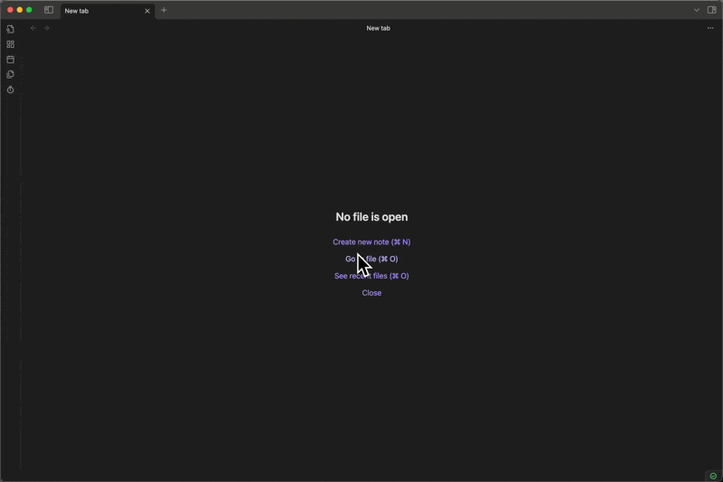

# Obsidian Punch Clock Plugin

A comprehensive punch clock plugin for Obsidian that enables precise time tracking with robust reporting and export capabilities.

## Features

- **Precise Time Tracking**: Track your activities down to the second
- **Multiple Views**: Daily, weekly, and monthly tracking views
- **Categorization**: Organize your time entries with custom categories and colors
- **Reporting**: View summaries of how you spend your time
- **Data Storage**: Your time data is automatically stored in CSV format

## Screenshots

## Installation

### From Obsidian Community Plugins

1. Open Obsidian
2. Go to Settings > Community plugins
3. Turn off Safe mode
4. Click Browse and search for "Punch Clock"
5. Install the plugin and enable it

### Manual Installation

1. Download the latest release from the GitHub repository
2. Extract the zip file into your Obsidian vault's `.obsidian/plugins/` directory
3. Restart Obsidian
4. Enable the plugin in Settings > Community plugins

## Setup

### Important: Show Data Files in Obsidian

**By default, Obsidian hides non-markdown files.** To see your time tracking data files (CSV and JSON), you need to enable them:

1. Go to **Settings > Files and links**
2. Find **"Detect all file extensions"** and **enable it**
3. Your time tracking files will now be visible in the file explorer

### Storage Directory

Configure where your time tracking data is stored:

1. Go to **Settings > Punch Clock**
2. Set **"Storage Directory"** (default: `punch-clock-data`)
3. Your data will be stored as:
   - `YYYY-MM.csv` files (monthly time entries)
   - `categories.json` (your categories)
   - `running-timer.json` (active timer state)

## Usage

### Basic Timer Controls

1. Click on the timer icon in the left sidebar (or use the Command Palette) to open the Punch Clock
2. Choose a category from the dropdown menu
3. Enter an optional memo describing your activity
4. Click "Start" to begin tracking time
5. Click "Stop" when you're done

### Quick Commands

The plugin adds several commands that you can use from the Command Palette:

- **Open Timer**: Opens the timer modal
- **Open Punch Clock Panel**: Opens the side panel view
- **Start Quick Timer**: Immediately starts a timer with the default category
- **Stop Current Timer**: Stops any running timer

### Views and Reports

- **Daily View**: See all time entries for the current day
- **Weekly View**: View time breakdown for the current week
- **Monthly View**: See monthly time summaries with category breakdown

### Settings

Configure the plugin in Settings > Punch Clock:

- **Categories**: Add, remove, or edit time entry categories with custom colors
- **Default Category**: Set the default category for quick timers
- **Auto-save**: Toggle automatic saving of time entries
- **Show in Ribbon**: Toggle visibility of the timer icon in the sidebar
- **Default View**: Set the default view for the Punch Clock panel (Daily/Weekly/Monthly)
- **Date Format**: Customize date display format using Moment.js syntax
- **Time Format**: Choose between 12-hour and 24-hour time formats
- **Storage Directory**: Configure where your time tracking data is stored
- **Start Day of Week**: Choose which day the week starts on (affects weekly view)

## Data Management

All time entries are stored locally in your Obsidian vault as CSV and JSON files:

- **Monthly CSV files**: `YYYY-MM.csv` (e.g., `2025-06.csv`) contain all time entries for that month
  - Format: `Date,Start Time,End Time,Duration(seconds),Duration(minutes),Duration(hours),Category,Memo`
  - Duration is provided in three formats for convenience: seconds (precise), minutes (rounded to 2 decimals), and hours (rounded to 2 decimals)
- **Categories file**: `categories.json` stores your custom categories and settings
- **Running timer**: `running-timer.json` maintains active timer state (automatically deleted when timer stops)

These files will sync across devices if you use Obsidian Sync and are directly editable if needed.

## License

MIT